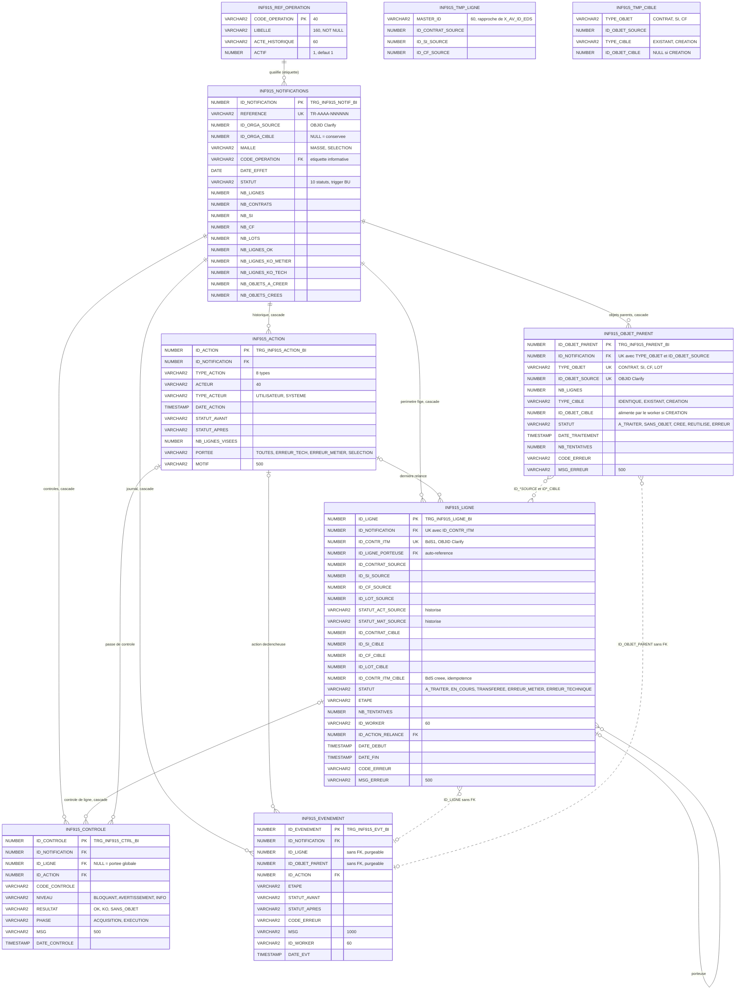

# INF915 — Modèle de données (Mermaid)

Source : `inf915_modele_demande_oracle11.sql`. 7 tables, 2 tables temporaires.

Lecture :
- trait plein = clé étrangère déclarée ;
- trait pointillé = lien logique, sans clé étrangère (identifiants Clarify ou journal purgeable) ;
- les identifiants Clarify (`ID_ORGA_*`, `ID_*_SOURCE`, `ID_*_CIBLE`, `ID_CONTR_ITM`) pointent vers `SA.*`, hors de ce modèle.

## Notes

- `INF915_TMP_LIGNE` et `INF915_TMP_CIBLE` : tables temporaires `ON COMMIT PRESERVE ROWS`, sans lien déclaré. Le service web les alimente, puis `INF915_PY.PR_CREER_DEMANDE` les lit et les purge. Elles produisent les lignes de `INF915_LIGNE` et `INF915_OBJET_PARENT`.
- Vues : `INF915_V_VOLUMETRIE` (compteurs recalculés), `INF915_V_JALON`, `INF915_V_SUIVI` (écran de suivi). Elles lisent les tables ci-dessus et ne portent aucune donnée propre.
- Cycle de vie de `STATUT` (`INF915_NOTIFICATIONS`) : 10 statuts, 19 transitions imposées par `TRG_INF915_NOTIF_BU`.
- Index uniques fonctionnels sur `INF915_ACTION` : une seule `CREATION` et une seule `ANNULATION` par demande.
